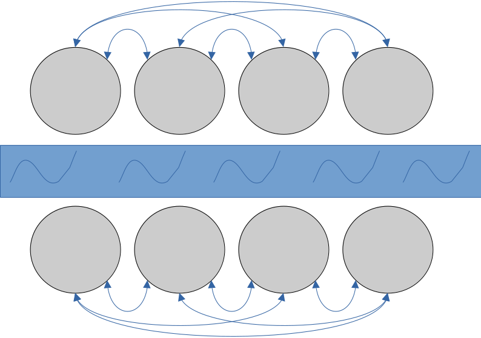

### Migration configuration matrices for Kiel 2025
In this folder we host the migration configuration matrices to run the experiments of maritime connectivity that we will present in Kiel. 

We generally assume that a maritime domain is composed by two sides of a metapopulation that are constantly connected, with migration between the two sides changing in time and configuration. 

From here, we consider different ways in which the two halves of the metapopulation can meet. Does each subpopulation on one side connect to a different subpopulation on the other side? Do they all connect to only one subpopulation on the other side? Or is there only a contact between two single subpopulations? And how long does this contact last? How long does it need to last for the migration event to have a lasting effect on the other subpopulation?

Basic configurations that we will adopt:
- island model
- front connection (migration possible between all facing subpopulations)
- single connection (migration possible only between two facing subpopulations)